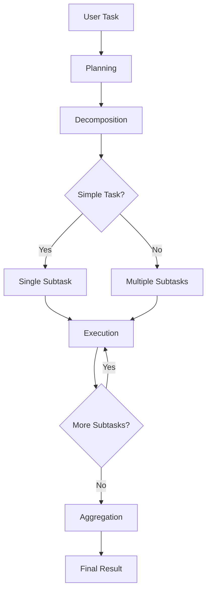

# SWE Agent Architecture

## Overview

SWE Agent is built on LangGraph, providing a structured workflow for task execution with four main phases: Planning, Decomposition, Execution, and Aggregation.

## Core Components

### 1. Agent State

The `AgentState` is the central data structure that flows through the workflow:

```python
class AgentState(TypedDict):
    messages: List[BaseMessage]          # Conversation history
    task_description: str                # Original user task
    context: Dict[str, Any]             # Execution context
    subtasks: List[Dict[str, Any]]      # Decomposed subtasks
    current_subtask: Optional[Dict]      # Currently executing subtask
    results: List[Dict[str, Any]]       # Execution results
    final_result: Optional[Dict]         # Final aggregated result
    iteration_count: int                 # Current iteration
    user_config: Dict[str, Any]         # User configuration
    permission_level: str                # Security permissions
    interactive_mode: bool               # Interactive mode flag
    paused: bool                        # Execution pause state
```

### 2. Workflow Phases

#### Planning Phase (`_planner_node`)
- Analyzes the user task
- Identifies required information and tools
- Creates high-level execution strategy
- Sets success criteria

#### Decomposition Phase (`_decomposer_node`)
- Intelligently breaks down tasks
- Avoids over-decomposition of simple tasks
- Creates atomic, executable subtasks
- Prioritizes subtasks by importance

#### Execution Phase (`_executor_node`)
- Executes subtasks using appropriate tools
- Provides real-time progress updates
- Verifies completion with concrete evidence
- Handles errors and retry logic

#### Aggregation Phase (`_aggregator_node`)
- Combines all subtask results
- Generates comprehensive final report
- Calculates success metrics
- Provides recommendations

### 3. Tool System

Tools are the building blocks for task execution:

```python
# File Operations
- file_read_tool: Read file contents
- file_writer_tool: Create/write files  
- file_edit_tool: Modify existing files
- multi_edit_tool: Batch file modifications

# Directory Operations
- directory_list_tool: List directory contents
- file_search_tool: Find files by pattern

# Code Analysis
- code_analysis_tool: Analyze code metrics
- grep_search_tool: Text pattern matching

# System Operations
- bash_tool: Execute shell commands
- web_request_tool: HTTP operations
```

### 4. Permission System

Three-tier security model:

- **Safe**: Read-only operations, basic commands
- **Elevated**: File modifications, package installation
- **Admin**: System administration, destructive operations

Permission checks occur before tool execution:

```python
def check_command_permission(self, command: str) -> Tuple[bool, str]:
    # Check command against permission level
    # Return (allowed, reason)
```

### 5. Configuration Management

Flexible configuration system supporting:
- YAML/JSON configuration files
- CLI argument overrides
- Environment variable integration
- Runtime configuration updates

## Data Flow



## Error Handling

### Graceful Degradation
- Tool failures don't stop entire workflow
- Retry logic for transient errors
- Fallback strategies for critical operations

### User Control
- Interrupt handling (Ctrl+C)
- Pause/resume functionality
- Interactive approval for elevated operations

### Error Recovery
- Automatic error classification
- Detailed error reporting
- Suggested remediation steps

## Memory and Persistence

### SQLite Checkpointing
- Optional conversation persistence
- Task resumption after interruption
- Context preservation across sessions

### State Management
- Immutable state transitions
- Complete execution audit trail
- Rollback capability for failed operations

## Performance Optimizations

### Request Throttling
- API rate limit compliance
- Configurable request intervals
- Smart batching of operations

### Tool Selection
- Dynamic tool routing
- Parallel tool execution where possible
- Tool result caching

### Memory Management
- Message history pruning
- Large file streaming
- Context window optimization

## Security Considerations

### Sandboxing
- Permission-based execution
- File system access controls
- Command whitelist/blacklist

### Input Validation
- Task description sanitization
- Tool parameter validation
- Path traversal prevention

### Audit Logging
- Complete operation logging
- Security event tracking
- Compliance reporting

## Extension Points

### Custom Tools
```python
@tool
def custom_tool(param: str) -> Dict[str, Any]:
    """Custom tool implementation"""
    # Tool logic here
    return {"result": "success"}
```

### Custom Workflow Nodes
```python
def custom_node(state: AgentState) -> AgentState:
    """Custom workflow node"""
    # Node logic here
    return updated_state
```

### Plugin System
- Tool plugin discovery
- Configuration plugin loading
- Runtime plugin registration

## Testing Strategy

### Unit Tests
- Individual component testing
- Tool isolation testing
- Permission system validation

### Integration Tests
- End-to-end workflow testing
- Multi-tool coordination
- Error scenario validation

### Performance Tests
- Load testing with multiple tasks
- Memory usage profiling
- API rate limit testing